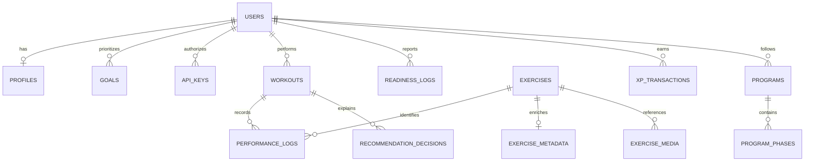

# Database architecture

The migrated relational core uses foreign keys, unique constraints, owner indexes and transactions. Immutable prescriptions and evidence are JSON snapshots deliberately retained to explain historical decisions. Extension-domain JSON is versioned but does not yet implement all requested normalization; see planned expansion below.

## Live schema domains

| Domain | Constraints and decisions |
| --- | --- |
| Users/profiles/goals | Unique email, one profile per user, unique goal/user pair, priorities 0–100; sum enforced transactionally by service |
| API keys | Unique digest; owner FK; expiry and revocation; raw secret never stored |
| Exercises | Namespaced upstream ID, source commit and content hash; source JSON retained without edits |
| Enrichment | One current metadata record/exercise; approval state/reviewer; proposed fields remain unknown |
| Media | Exercise FK; unique kind/exercise pair; exact source path and copyright; default blocked delivery |
| Media license grants | Indexed media FK, pinned source path/commit, evidence reference, reviewer, optional expiry, revocation; migrations 0002 and 0003 |
| Relations | Exercise and related-exercise FKs; unique relation triple |
| Workouts | Unique owner/local-day; version, status and immutable plan snapshot |
| Performance logs | Owner/workout/exercise FKs; unique owner/event and workout/exercise/set; payload hash detects conflicting retries |
| Decisions | Owner/workout FKs; engine version, reasoning snapshot and time |
| XP | Unique owner/event, nonnegative amount; no penalty ledger |
| Programs/phases | User ownership and phase/program FK; full scheduling engine pending |
| Assessments, recovery, pain, measurements | Owner/time indexes; versioned sparse payloads |
| Nutrition profiles/targets/meals | Owner-scoped versioned data; only target service implemented |
| Wearable/camera domains | Owner-scoped future records; no connected adapters or sensor collection |
| Achievements/challenges/notifications | Domain foundations; reward mechanics beyond XP pending |
| AI interactions/audit | Owner-scoped records; no raw prompt storage by default; broader audit coverage pending |

DDL for PostgreSQL is generated from the same metadata in `schema.postgresql.sql`; the initial migration contains a frozen schema snapshot. Database URLs/credentials are runtime secrets. SQLite foreign-key checks are enabled explicitly.

## Required normalization evolution

Add workout_exercises and prescribed_sets referencing stable exercise and workout IDs, with order/phase, rep bounds, target load, RPE/RIR and rest constraints. Keep plan snapshots as an audit record, and transactionally populate normalized rows. Link actual set logs to prescription revision. Add event revision/tombstone records for supported correction workflows.

Split capability assessments into assessment_runs, assessment_metrics, metric_definitions, sources, confidence and timestamps. Separate profile restrictions by medical restriction/injury/pain/movement limitation/preference; enforce read/write permissions for sensitive subdomains.

Add exercise_muscles with primary/secondary contribution, vocabulary tables for muscles/equipment/patterns, metadata_revisions and reviewer/evidence tables. Expand nutrition with foods, allergens, food_allergens, meal_items, intake and target history. Add wearable consent/connections/measurements with provider-event uniqueness and normalized units; camera consent/session/derived_metrics without raw video by default. Add challenge_memberships and user_achievements, notification delivery attempts and outbox events for reliable jobs.

These are explicitly pending migrations, not claimed live tables. Avoid silently treating a JSON placeholder as a completed production domain.

## Neural training tables (migration 0004)

- learning_consent: one opt-in state and rotating consent grant per owner.
- learning_examples: owner/event uniqueness, source, quality state, validated feature/outcome JSON and payload hash.
- learning_models: numeric model artifact, evaluation and split lineage, dataset hash, review and lifecycle state.
- learning_members: model/user/grant lineage for training and evaluation participants; unique model/user pair.
- learning_deployment: constrained global pointer and shadow/live mode. Invalidated models are never served.

Model weights are intentionally stored in the database to keep backup and promotion transactional. Full source snapshots are not copied into each model; model reports retain sample IDs and a dataset hash. Backup files are private operational artifacts, excluded from source control.

## Guided source observations (migration 0005)

`user_contributions`: owner FK; exercise FK; unique owner/event; unique owner/session/exercise; occurred_at and created_at; current consent grant; payload hash; pending/reviewed state; original nullable answers; frozen historical features; completeness report and review provenance. These source records are separate from fully validated neural examples. Collection exports are private pseudonymous operational data, not part of the exercise knowledge-base ZIP.

Survey bridge migration 0006 adds `survey_participants` (hashed private codes and revocation), `survey_responses` (revision/checksum and contribution linkage, no duplicate raw response payload) and short-lived `survey_receipts` (replay prevention). Participant rows reference isolated pseudonymous user identities. Corrections invalidate influenced models and regenerate derived history; withdrawal clears contributions and revokes the participant link.
