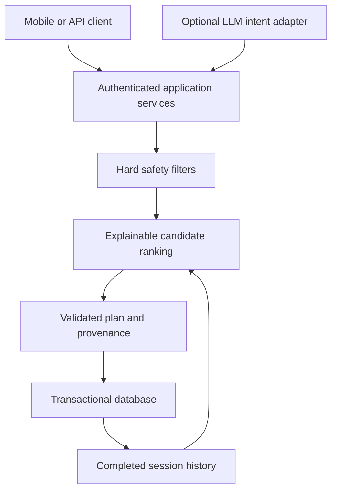

# Technical design

## Stack decision

React Native/Expo gives one TypeScript UI across Android/iOS and access to native SQLite and secure credential storage. FastAPI supplies request validation and OpenAPI; PostgreSQL is the deployment database; SQLite supports local development. The native health and camera components need development builds and their own platform adapters. Current pinned mobile baseline: Expo 54, React Native 0.81.5. See the [Expo SDK documentation](https://docs.expo.dev/versions/v54.0.0/) and [SQLite documentation](https://docs.expo.dev/versions/v54.0.0/sdk/sqlite/).

## Three decision layers

Implemented: deterministic rules and explainable weighted ranking. Not implemented: external LLM and trained recommendation model. The coach endpoint identifies itself as rule-based and returns no fabricated actions. The intended LLM layer can select typed application tools; it cannot write SQL, select a user ID, skip safety, invent progress or return authoritative unsaved workouts.

## Request processing

Authenticate an opaque token → enforce scope → resolve owner from token → validate request → enforce workout state and safety → transact mutation and decision record → return response. Owner IDs supplied by clients are never accepted for resource authorization. Key hashes are indexed. Transactions protect goals, plans, logs, XP and account deletion. PostgreSQL row locks serialize plan creation/completion per owner or workout.

Current plan creation uses local profile timezone and an owner/day uniqueness constraint. Day changes do not invalidate historical records. Past prescriptions are immutable JSON snapshots for audit; model response is computed from completed historical workout logs.

## Ranking and adaptation

Candidates without approved metadata are excluded. Equipment, blocked patterns, skill, preferences and restrictions are evaluated before scores. Weighted goal fit, compatibility and historical adherence add score; fatigue penalizes score. These weights are implementation heuristics, not validated physiological estimates. Three distinct completed sessions are needed before the initial 2.5% increase or 10% reduction rule. This rule is intentionally limited and does not constitute a complete deload/periodization model.

Workload calculation has direct and half-weight secondary contributions with overlap deduplication. The result is an explicitly labeled heuristic; it is not yet a weekly constraint in the planner. The planner currently programs resistance patterns; weighted cardio/mobility preferences do not yet produce a full concurrent program.

## Offline protocol

Persist each set before attempting transmission. Client-generated UUID is stable throughout retry. The server enforces owner/event uniqueness and workout/exercise/set uniqueness. Same event/same body returns its previous result; changed body returns 409. Retain unresolved conflicts in the outbox. Persist session snapshot and English instructions. Tutorial GIFs are now served from supplied local files after an authenticated rights check. The player attaches credentials only to validated application-relative routes; no third-party media host receives account credentials. Native media caching remains disabled. Reject expired credentials for remote reads; permit local draft logging without inventing refreshed credentials.

Pending limitations: full reconciliation UI, local at-rest database encryption, account-switch replay tests, stale-plan revalidation across offline state changes and native device tests. SQLite outbox behavior is implemented but not device-validated.

## Future adapters

Wearable measurements: provider ID, external event ID, consent version, start/end timestamps, unit, original value, normalized value, quality and source priority. Deduplicate provider/event IDs; no single HRV/RHR value controls a session. Health tokens remain server-encrypted or OS-protected as appropriate.

Camera: explicit opt-in, permission prompt, on-device frames → pose keypoints → confidence gate → exercise-specific state machine → rep/tempo/ROM signals. Never infer injury or guarantee form safety. Discard frames by default. Low-confidence or unsupported exercise means no coaching cue.

ML: event definitions and provenance must be stable before training. Use temporal/user-separated validation; evaluate subgroup performance and calibration, compare with rules, shadow-mode first, rollback on safety/adherence regressions. No untrained system is described as learning.

## Scientific policy grounding

Progressive resistance training should account for experience, goals and context; the [ACSM progression position stand](https://pubmed.ncbi.nlm.nih.gov/19204579/) is a foundational reference, not validation of this implementation. Calorie requirements are estimates requiring individual context and monitoring; see [NIDDK's Body Weight Planner](https://www.niddk.nih.gov/bwp). Current scoring weights and thresholds still require review and evaluation.
